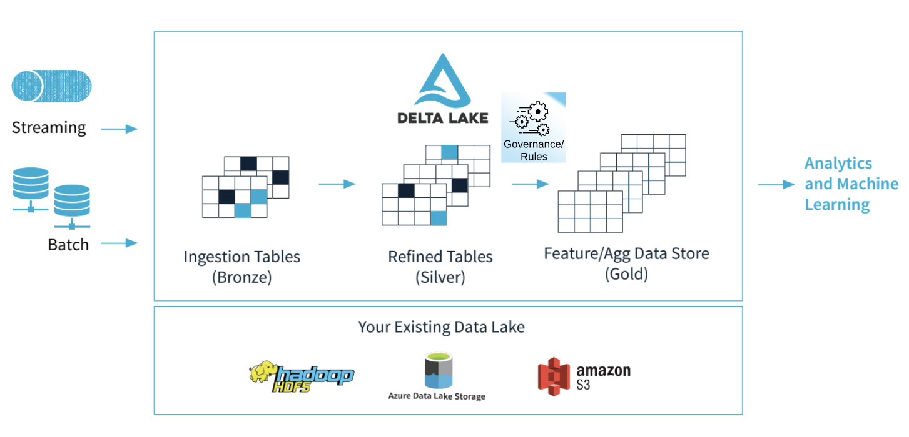
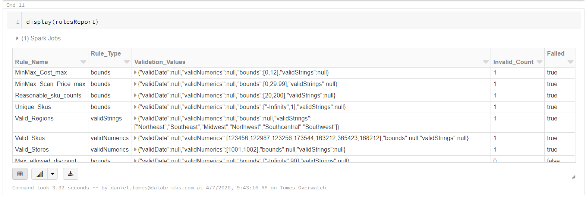

# Rules Engine
Simplified Validation for Production Workloads

## Project Description
As pipelines move from bronze to gold, it's very common that some level of governance be performed in
Silver or at various places in the pipeline. The need for business rule validation is very common.
Databricks recognizes this and as such is building Delta Pipelines with Expectations are coming soon 
and will likely reduce the need for a rules engine like this but it's possible that simple rules are needed
where Delta Pipelines are a bit overkill or not in line with the overall workload. After the release
of Delta Pipelines and Expectations the code base will be reviewed and adjusted appropriately. That may mean to 
extend Expectations, add a simplified wrapper, or both, or none. We'll have to wait and see what Delta 
Pipelines and Expectations looks like when it's released.

Introducing Databricks Labs - Rules Engine, a simple solution for validating data in dataframes before you
move the data to production and/or in-line (coming soon). 


## Using The Rules Engine In Your Project
* Pull the latest release from the releases
* Add it as a dependency (will be in Maven eventually)
* Reference it in your imports

## Getting Started
A list of usage examples is available in the `demo` folder of this repo in [html](demo/Rules_Engine_Examples.html) 
and as a [Databricks Notebook DBC](demo/Rules_Engine_Examples.dbc).

The process simple:
* Define Rules
* Build a RuleSet from your Dataframe using your Rules you built
```scala
import com.databricks.labs.validation.utils.Structures._
import com.databricks.labs.validation._
```

As of version 0.1 There are three primary rule types
* Boundary Rules
* Categorical Rules (Strings and Numerical)
* Date Rules (in progress)

Rules can be composed of: 
* simple column references `col("my_column_name")`
* complex columns `col("Revenue") - col("Cost")`
* aggregate columns `min("ColumnName")`

Rules can be applied to simple DataFrames or grouped Dataframes. To use a grouped dataframe simply pass 
your dataframe into the RuleSet and pass one or more columns in as `by` columns. This will apply the rule
at the group level which can be helpful at times.

### Simple Rule
`val validateRetailPrice = Rule("Retail_Price_Validation", col("retail_price"), Bounds(0.0, 6.99))`

### List of Rules
NOTE: While validations can be performed on aggregate cols (whether the DF is grouped or not) aggregate columns
only return a single value - as such the failed count will be set to 1 for failures so for aggregate columns
the `Invalid_Count` is rendered somewhat useless. Better granularity can be seen in the report when not using 
aggregates.
```scala
val specializedRules = Array(
  // Example of aggregate column
  Rule("Reasonable_sku_counts", count(col("sku")), Bounds(lower = 20.0, upper = 200.0)),
  // Example of calculated column from optimized UDF
  Rule("Max_allowed_discount",
    max(getDiscountPercentage(col("retail_price"), col("scan_price"))),
    Bounds(upper = 90.0)),
  // Example distinct values rule
  Rule("Unique_Skus", countDistinct("sku"), Bounds(upper = 1.0))
)
```

### MinMax Rules
It's very common to build rules to validate min and max allowable values so there's a helper function
to speed up this process. It really only makes sense to use minmax when specifying both an upper and a lower bound
in the Bounds object. Using this method in the example below will only require three lines of code instead of the 6
if each rule was built manually
```scala
val minMaxPriceDefs = Array(
  MinMaxRuleDef("MinMax_Sku_Price", col("retail_price"), Bounds(0.0, 29.99)),
  MinMaxRuleDef("MinMax_Scan_Price", col("scan_price"), Bounds(0.0, 29.99)),
  MinMaxRuleDef("MinMax_Cost", col("cost"), Bounds(0.0, 12.0))
)

// Generate the array of Rules from the minmax generator
val minMaxPriceRules = RuleSet.generateMinMaxRules(minMaxPriceDefs: _*)
```
OR -- simply add the list of minmax rules or simple individual rule definitions
to an existing RuleSet (if not using builder pattern)
```scala
val someRuleSet = RuleSet(df)
someRuleSet.addMinMaxRules(minMaxPriceDefs: _*)
someRuleSet.addMinMaxRules("Retail_Price_Validation", col("retail_price"), Bounds(0.0, 6.99))
```

### Categorical Rules
There are two types of categorical rules which are used to validate against a pre-defined list of valid
values. Currently (as of 0.1) accepted categorical types are String, Double, Int, Long
```scala
val catNumerics = Array(
Rule("Valid_Stores", col("store_id"), Lookups.validStoreIDs),
Rule("Valid_Skus", col("sku"), Lookups.validSkus)
)

val catStrings = Array(
Rule("Valid_Regions", col("region"), Lookups.validRegions)
)
```

### Validation
Now that you have some rules built up... it's time to build the ruleset and validate it. As mentioned above,
the dataframe can be simple or groupBy column[s] can be passed in (as string) to perform validation at the 
grouped level.
```scala
val (rulesReport, passed) = RuleSet(df)
.add(specializedRules)
.add(minMaxPriceRules)
.add(catNumerics)
.add(catStrings)
.validate()

val (rulesReport, passed) = RuleSet(df, Array("store_id"))
.add(specializedRules)
.add(minMaxPriceRules)
.add(catNumerics)
.add(catStrings)
.validate()
``` 
The validation returns two items, a boolean (true/false) as to whether all rules passed or not. If a single rule
fails the `passed` value above will return false. The `rulesReport` is a summary of which rules failed and,
if the input column was not an aggregate column, the number of failed records. An image of the report is below.


## Next Steps
Clearly, this is just a start. This is a small package and, as such, a GREAT place to start if you've never
contributed to a project before. Please feel free to fork the repo and/or submit PRs. I'd love to see what
you come up with. If you're not much of a developer or don't have the time you can still contribute! Please
post your ideas in the issues and label them appropriately (i.e. bug/enhancement) and someone will review it 
and add it as soon as possible.

Some ideas of great adds are:
* Add a Python wrapper
* Refactor Rule and/or Validator to implement an Abstract class or trait
    * There's a clear opportunity to abstract away some of the redundancy between rule types.
* Implement a fast runner 
    * Optimize performance by failing fast for big data. Smart sampling could be implemented to review subsets
    of columns/records and look for failures to enable a faster failure.
* Implement tests
    * Yeah, I know...I should have done this on day 0...but...time is always an issue. I plan to come back and add
    tests but if you'd like to add tests, that's a great way to learn code base (especially one this small) 
* Implement the date time rule (or somet other custom rule)
    * The date time rule has already been scaffolded, it just needs to be built out
    * What kind of complex rules does your business require that isn't possible here
* Add a quarantine pattern 
    * Enable a configuration to a Ruleset to identify records that didn't pass the validations and add
    them to a predefined quarantine zone.
* Add logic to attempt to auto-handle certain types of failures based on common business patterns 


## Legal Information
This software is provided as-is and is not officially supported by Databricks through customer technical support channels.
Support, questions, and feature requests can be submitted through the Issues page of this repo.
Please see the [legal agreement](LICENSE.txt) and understand that issues with the use of this code will 
not be answered or investigated by Databricks Support.  

## Core Contribution team
* Lead Developer: [Daniel Tomes](https://www.linkedin.com/in/tomes/), Practice Leader, Databricks
* Developer: <b> your name here </b> Contribute to the project


## Project Support
Please note that all projects in the /databrickslabs github account are provided for your exploration only, 
and are not formally supported by Databricks with Service Level Agreements (SLAs).  
They are provided AS-IS and we do not make any guarantees of any kind.  
Please do not submit a support ticket relating to any issues arising from the use of these projects.

Any issues discovered through the use of this project should be filed as GitHub Issues on the Repo.  
They will be reviewed as time permits, but there are no formal SLAs for support.


## Building the Project
To build the project: <br>
```
cd Downloads
git pull repo
sbt clean package
```
